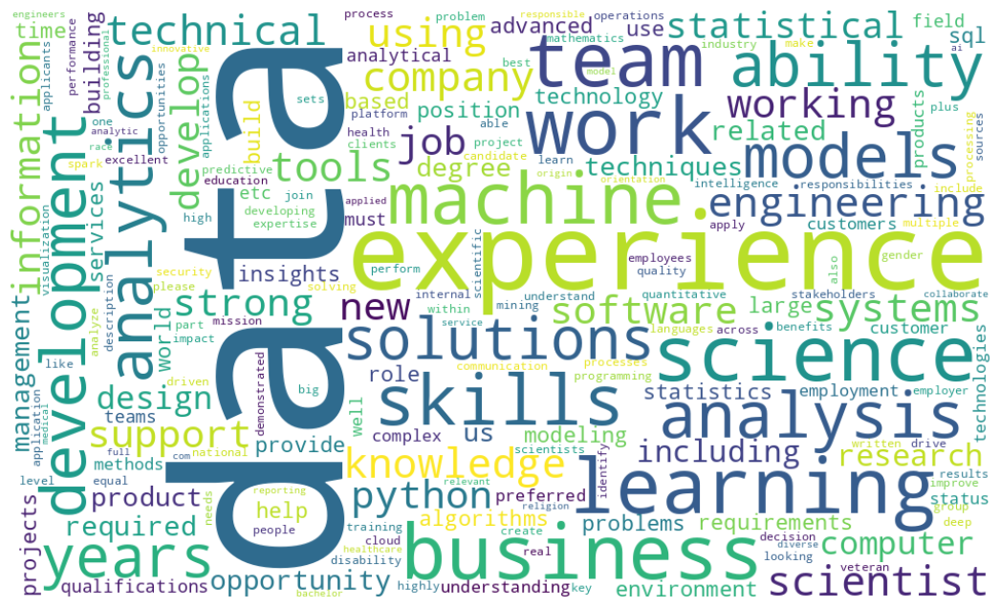
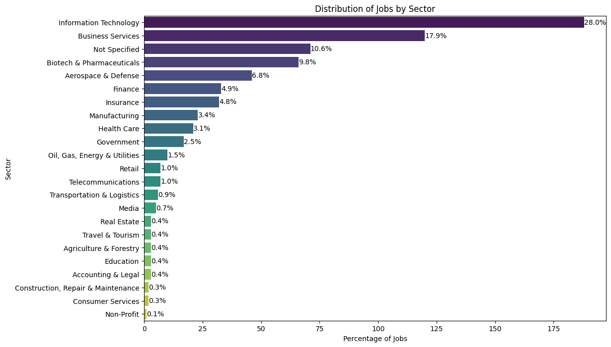

<h1>About</h1>
This is written for my Data Analyst project portfolio.
<h1>Dataset</h1>
The dataset used for the Glassdoor job postings is available in <a href='https://www.kaggle.com/datasets/rashikrahmanpritom/data-science-job-posting-on-glassdoor'>Kaggle</a>.
The data was scrapped from Glassdoor's website. There are two versions of the data one is uncleaned and another one is cleaned.
<h2>Features</h2>
  <ul>
    <li>index</li>
    <li>Job Title - <i>Title of the job posting</i></li>
    <li>Salary Estimate - <i>Salary range for that particular job</i></li>
    <li>Job Description - <i>This contains the full description of that job</i></li>
    <li>Rating - <i>Rating of that post</i></li>
    <li>Company Name - <i>Name of company</i></li>
    <li>Location - <i>Location of the company</i></li>
    <li>Headquarters - <i>Location of the headquater</i></li>
    <li>Size - <i>Total employee in that company</i></li>
    <li>Founded</li>
    <li>Type of ownership - <i>Describes the company type i.e non-profit/public/private farm etc</i></li>
    <li>Industry - <i>Field applicant will work in</i></li>
    <li>Sector - <i>Field applicant will work in</i></li>
    <li>Revenue - <i>Total revenue of the company</i></li>
    <li>Competitors</li>
  </ul>
<h1>Data Cleaning and Transformation</h1>
Check each column to verify that there are no errors and missing data.
 
Simplify data to appropriately categorize or analyze them later.
<h1>Exploratory Data Analysis</h1>
Utilized nltk (Natural Language Toolkit) and CountVectorizer to uncover patterns and gain meaningful insights from Job Description column. The result presented a comprehensive view of the frequency of each term across all job descriptions. The top keywords revealed the most prevalent terms in job descriptions, shedding light on the skills and qualifications currently in demand, insights that are invaluable for job seekers, employers, and industry observers aiming to navigate the dynamic job market.
 

The 28% share underscores IT as a dominant and rapidly expanding sector. Professionals in software development, cybersecurity, data science, and emerging technologies are likely to find abundant opportunities, reflecting the critical role technology plays in various industries.
 
The 17.9% share highlights the strategic importance of Business Services in data-driven decision-making and operational optimization. Professionals in consulting, analytics, and management services play key roles in shaping business strategies.
 

